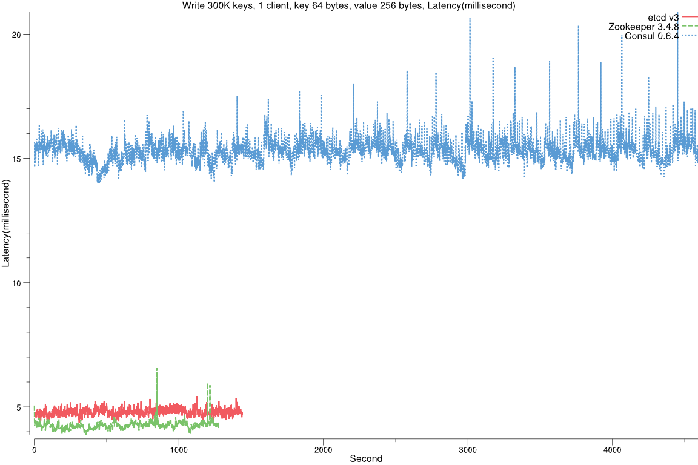
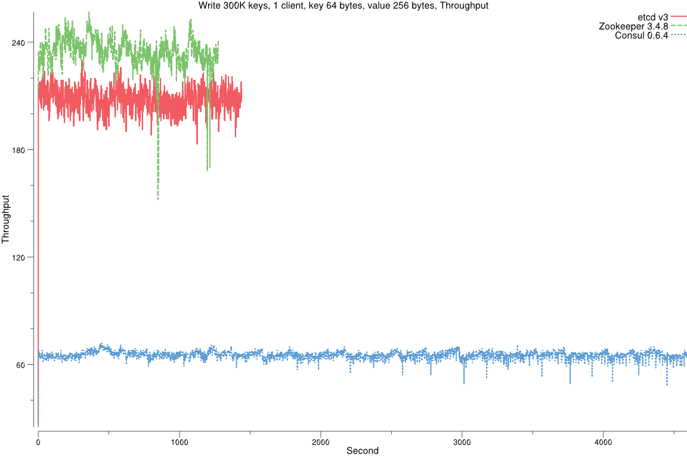
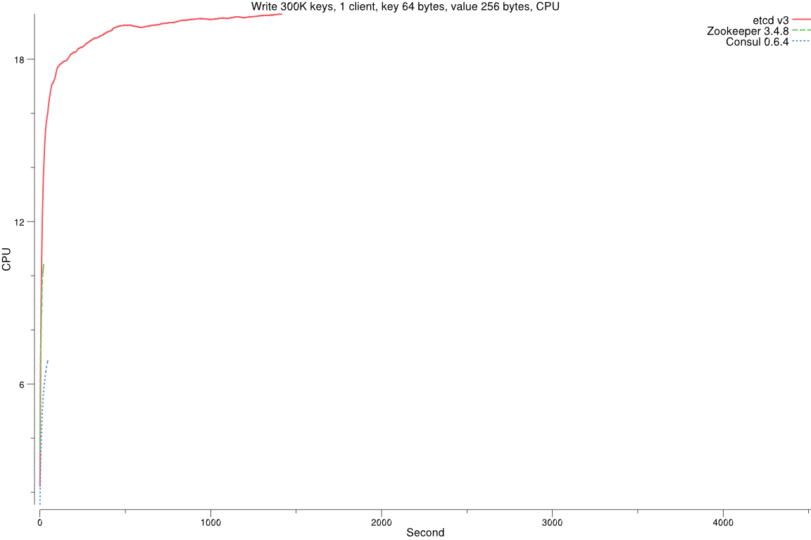
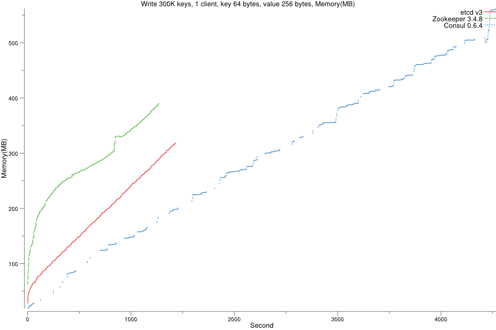
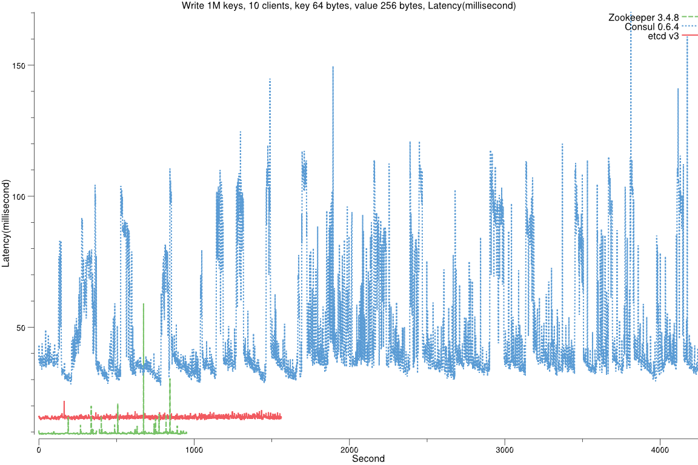
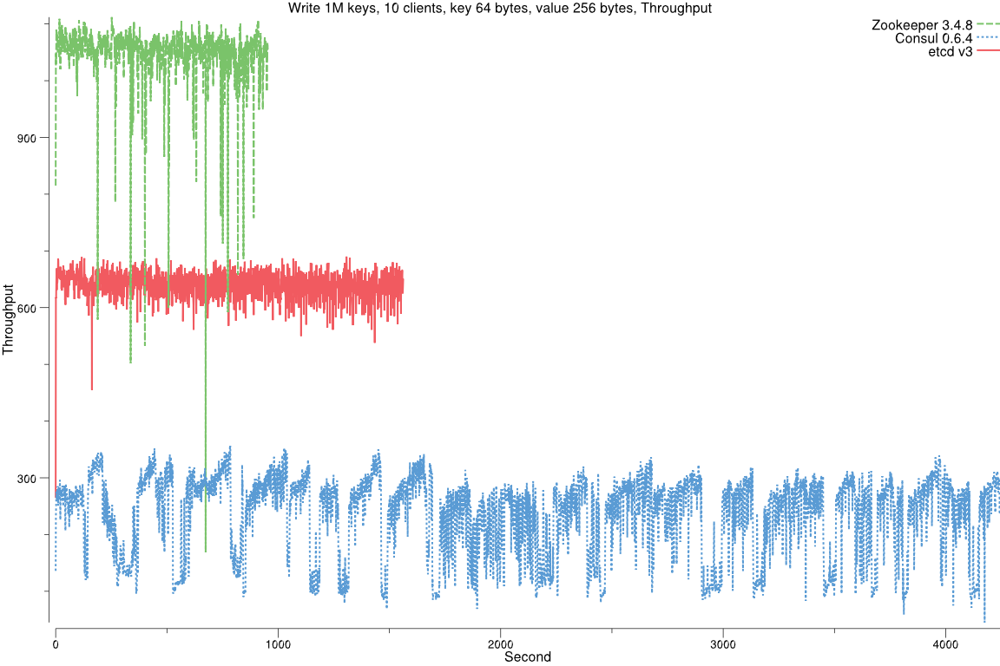
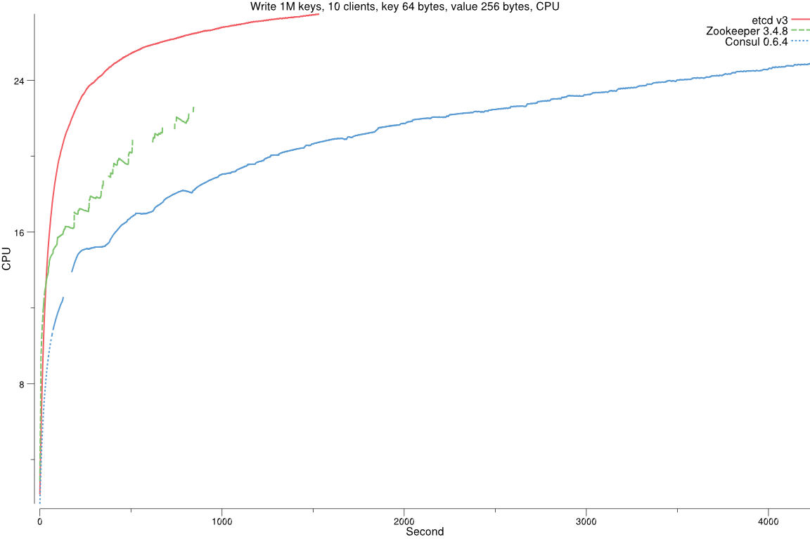
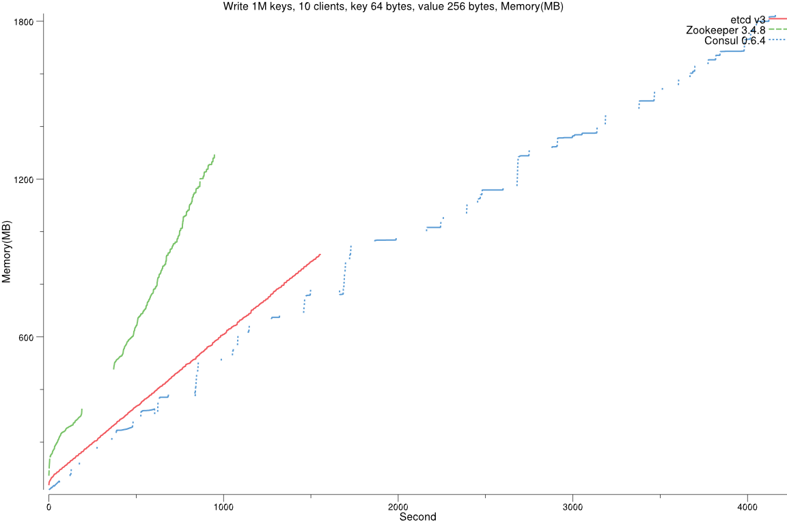

- Google Cloud Compute Engine
- 3 machines(server) of 8 vCPUs + 16GB Memory + 375GB local SSD (SCSI)
- 1 machine(client) of 16 vCPUs + 30GB Memory + 50GB SSD
- Ubuntu 15.10
- Go 1.6 with etcd master branch as of testing date
- Java 8 with Zookeeper 3.4.8(current)
  - Java(TM) SE Runtime Environment (build 1.8.0_74-b02)
  - Java HotSpot(TM) 64-Bit Server VM (build 25.74-b02, mixed mode)

  

##### Write 300K keys, 1 client, key 64 bytes, value 256 bytes

  

##### Write 3M keys, 1K clients, key 64 bytes, value 256 bytes

