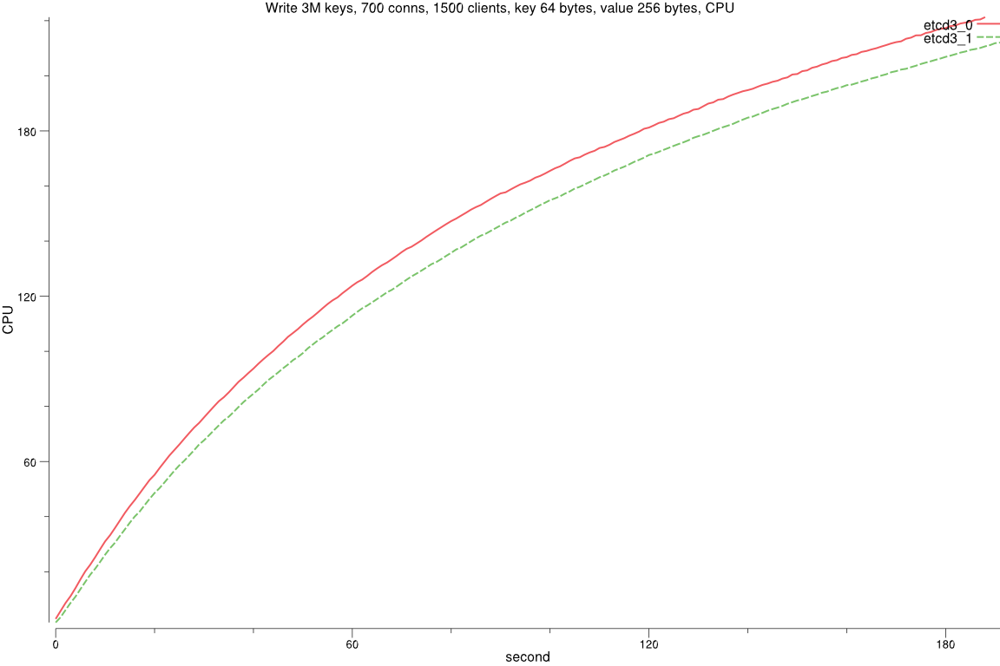
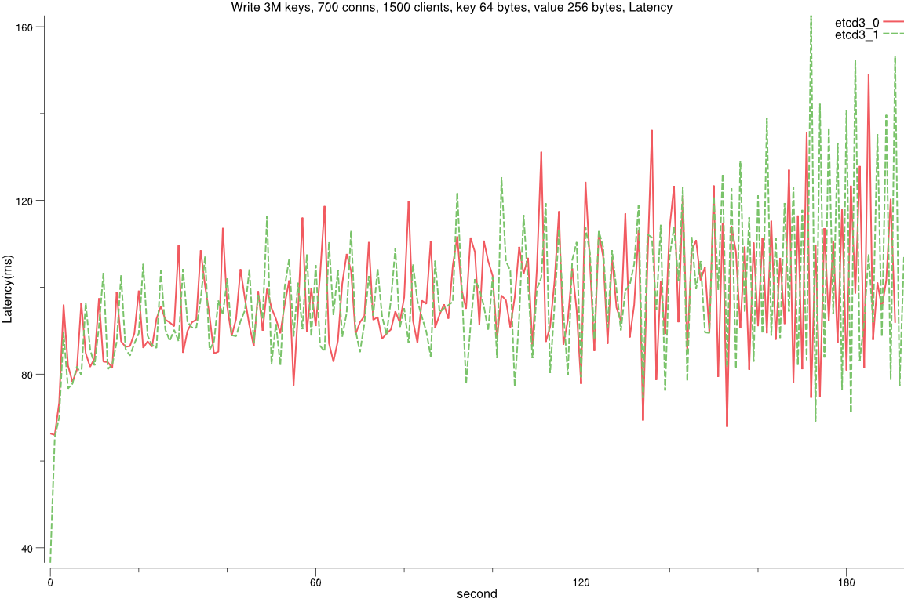
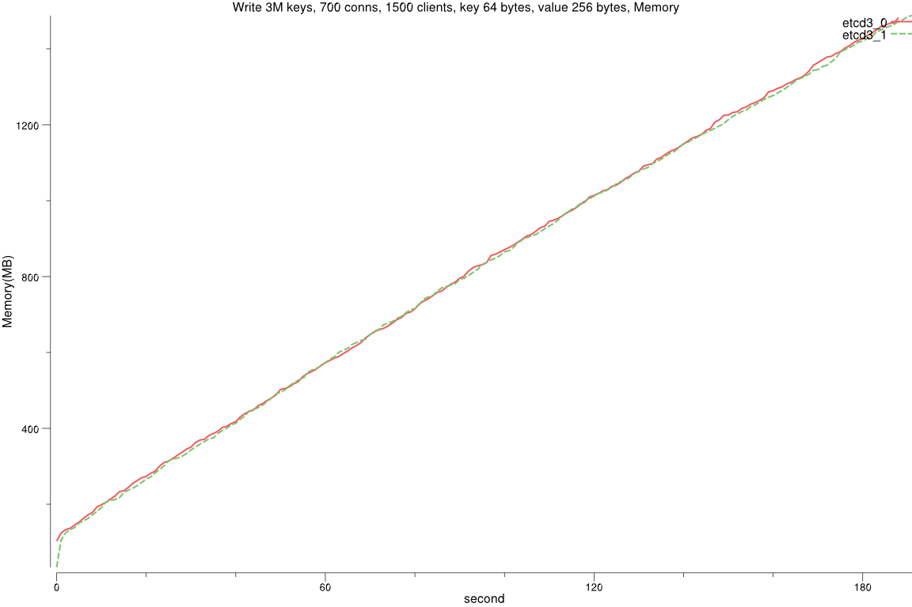
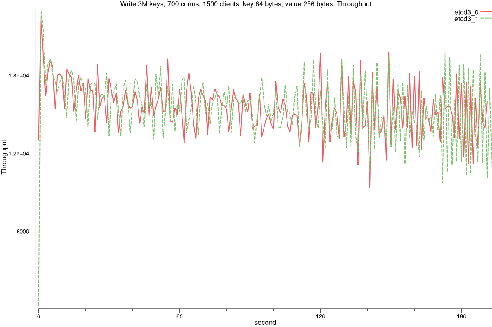

#### Testing environment
- Google Cloud Compute Engine
- 8 vCPUs + 16GB Memory + 375GB local SSD (SCSI)
- Ubuntu 15.10
- Go 1.6 with etcd master branch as of testing date
- Java 8 with Zookeeper 3.4.8(current)
	- Java(TM) SE Runtime Environment (build 1.8.0_74-b02)
	- Java HotSpot(TM) 64-Bit Server VM (build 25.74-b02, mixed mode)
- Serialized read

  

##### Results

